# EOP 教學管理平台 — 完整操作流程

## 總覽

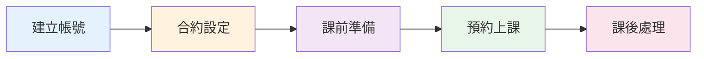

---

## 一、建立帳號（員工操作）

> 所有帳號都必須由員工邀請，無法自行註冊。

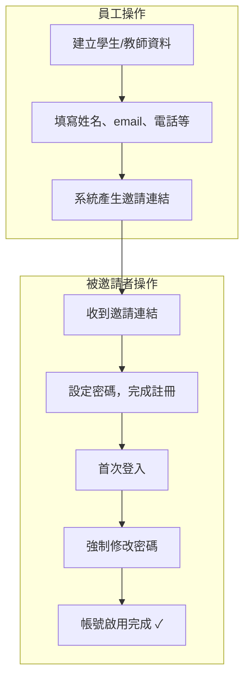

### 角色說明

| 角色 | 說明 | 權限 |
|------|------|------|
| **學生 Student** | 試上生或正式生 | 查看自己的預約、合約 |
| **教師 Teacher** | 授課老師 | 查看/確認自己的預約、管理時段 |
| **員工 Employee** | 後台管理人員 | 完整 CRUD 操作 |
| **管理員 Admin** | 系統管理員 | 所有權限 + 角色管理 |

---

## 二、合約設定（員工操作）

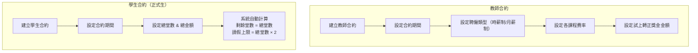

> **試上生不需要合約**，可直接預約試上課程。

---

## 三、課前準備（員工操作）

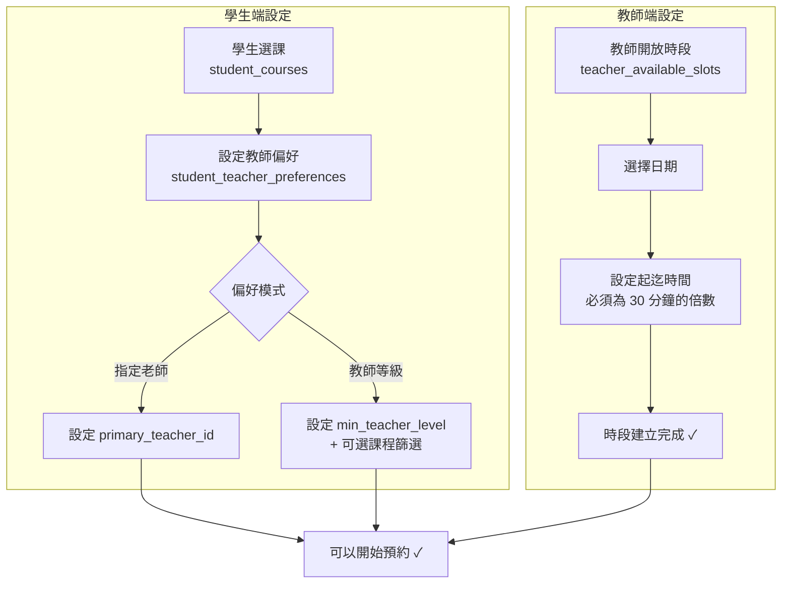

### 教師時段說明

- 時段以 **30 分鐘** 為最小區塊
- 例：開放 09:00–12:00 = 6 個 30 分鐘區塊
- 同一時段可容納多筆不重疊的預約
- 所有區塊被預約後，時段標記為 `is_booked = true`

---

## 四、預約上課

### 4-1. 預約建立流程

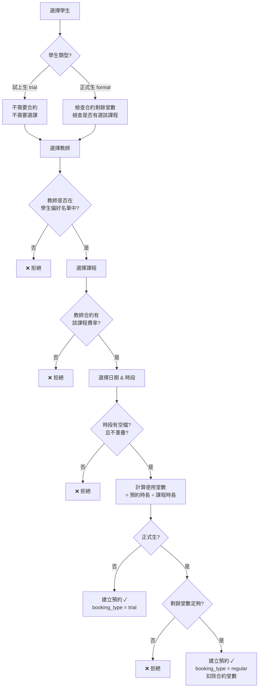

### 4-2. 預約狀態流轉

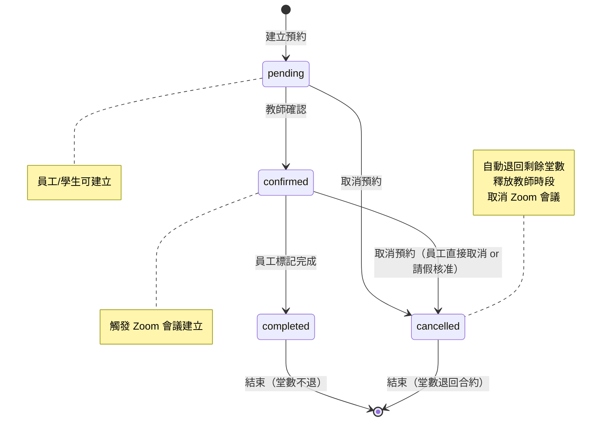

### 4-3. 預約操作權限

| 操作 | 學生 | 教師 | 員工 |
|------|------|------|------|
| 建立預約 | ✅ 只能幫自己 | ❌ | ✅ 可幫任何學生 |
| 確認預約 | ❌ | ✅ 只能確認自己的 | ✅ |
| 標記完成 | ❌ | ❌ | ✅ |
| 取消預約 | ❌ | ❌ | ✅ |
| 刪除預約 | ❌ | ❌ | ✅（僅 pending/cancelled）|
| 縮短時間 | ❌ | ❌ | ✅（只能縮短，不能延長）|
| 申請請假 | ✅ 只能幫自己 | ✅ 只能幫自己 | ✅ |
| 審核請假 | ❌ | ❌ | ✅ |
| 指派代課 | ❌ | ❌ | ✅ |
| 取消代課 | ❌ | ❌ | ✅ |

### 4-4. 批次預約

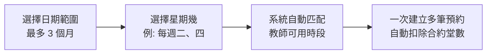

### 4-5. 取消預約副作用

當預約狀態變更為 `cancelled` 時，系統自動執行以下操作：

1. **堂數歸還** — 將 `lessons_used` 加回學生合約的 `remaining_lessons`
2. **時段釋放** — 重新計算教師時段的 `is_booked` 狀態
3. **Zoom 取消** — 非同步取消該預約的 Zoom 會議

> 此邏輯由 `cancel_booking_side_effects` 共用函式處理，適用於：直接取消、請假核准取消、批次取消、刪除預約。

---

## 五、請假流程

### 5-1. 請假申請

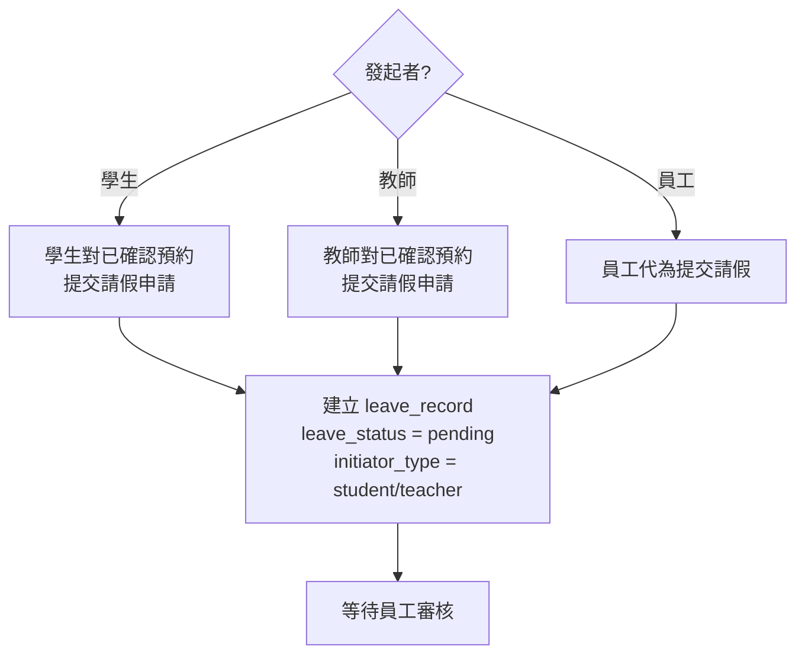

### 5-2. 請假審核（員工操作）

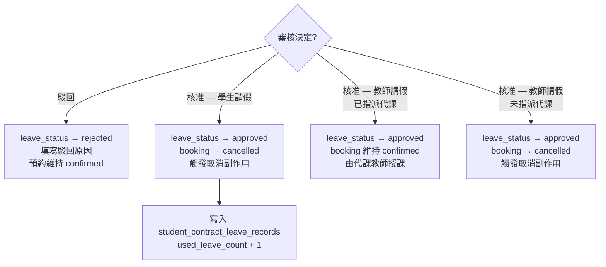

### 5-3. 請假狀態

| 狀態 | 說明 |
|------|------|
| `pending` | 等待審核 |
| `approved` | 已核准 |
| `rejected` | 已駁回（含駁回原因） |
| `cancelled` | 已撤回（發起者或員工可撤回 pending 狀態的申請） |

---

## 六、代課流程

### 6-1. 指派代課（員工操作）

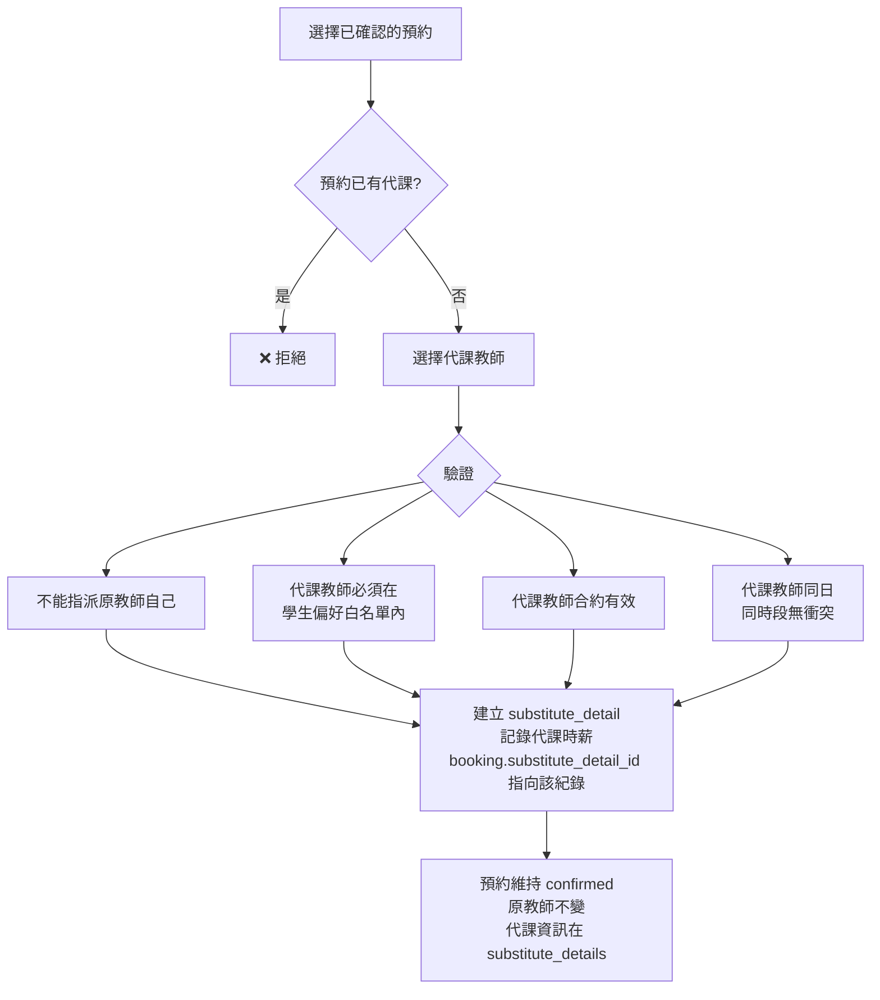

### 6-2. 取消代課（員工操作）

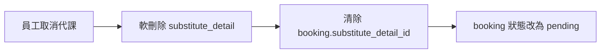

### 6-3. 教師請假 + 代課的完整流程

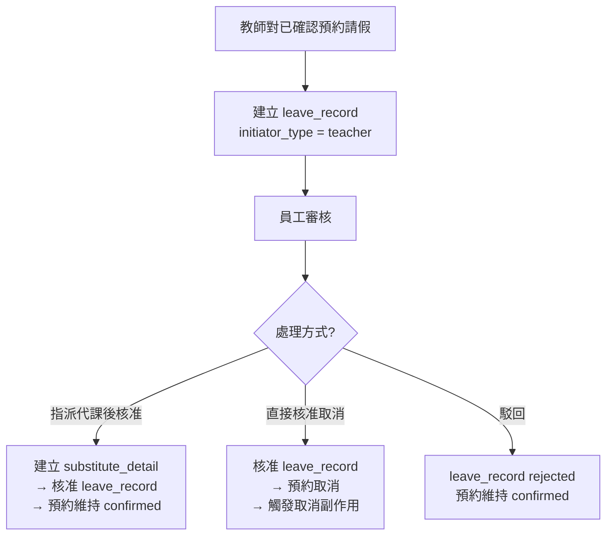

---

## 七、課後處理

### 7-1. 試上完成獎金

當員工將試上預約 (`booking_type = trial`) 標記為 `completed` 時，系統自動：
- 從教師合約取得 `trial_completed_bonus` 金額
- 寫入 `teacher_bonus_records`（金額可以為 0）

### 7-2. 試上轉正

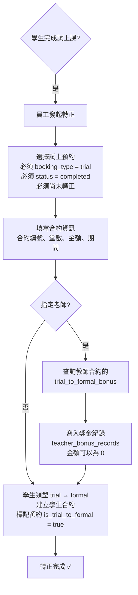

### 7-3. 教師獎金

| 獎金類型 | 說明 | 觸發時機 |
|---------|------|---------|
| `trial_completed` | 試上完成獎金 | 試上預約標記完成時自動記錄 |
| `trial_to_formal` | 試上轉正獎金 | 試上生轉正時自動記錄 |
| 其他自訂類型 | 績效獎金等 | 員工手動建立 |

### 7-4. 正班 / 加班堂數計算

針對**月薪制（full_time）**教師的預約，系統依課程時長拆分正班與加班堂數：

- 以課程的 `duration_minutes` 為一堂
- 從預約開始時間逐堂判斷：
  - 該堂完全落在教師合約的 `[work_start_time, work_end_time]` 內 → **正班**
  - 否則 → **加班**

```
教師合約工時: 09:00 ~ 18:00
課程時長: 60 分鐘
預約時段: 17:00 ~ 19:00（共 2 堂）

第 1 堂 17:00-18:00 → 落在工時內 → 正班
第 2 堂 18:00-19:00 → 超出工時   → 加班

結果: regular_lessons = 1, overtime_lessons = 1
```

---

## 八、Zoom 整合

- 預約狀態變為 `confirmed` 時 → 非同步自動建立 Zoom 會議
- 預約狀態變為 `cancelled` 時 → 非同步自動取消 Zoom 會議
- 支援 OAuth 授權綁定 Zoom 帳號
- 可透過 `ZOOM_ENABLED` 環境變數開關

---

## 完整生命週期

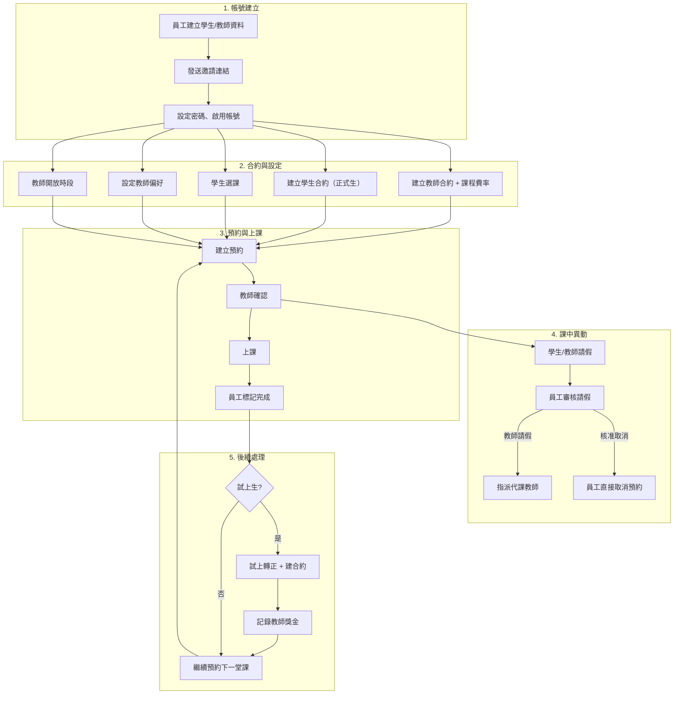

---

## 附錄：30 分鐘區塊系統

```
教師時段: 09:00 ~ 12:00（共 6 個區塊）

 09:00  09:30  10:00  10:30  11:00  11:30  12:00
   |------|------|------|------|------|------|
   | 預約A (09:00-10:00)  |      | 預約B       |
   |=======|=======|      |      |=======|======|
   | block1| block2|block3|block4| block5|block6|
   |  佔用  |  佔用  | 空閒  | 空閒  |  佔用  | 佔用 |

→ is_booked = false（還有空閒區塊）
→ 新預約可選 10:00-11:00
```
