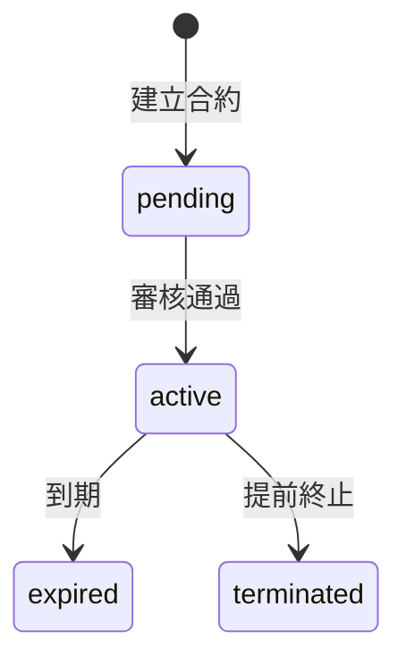
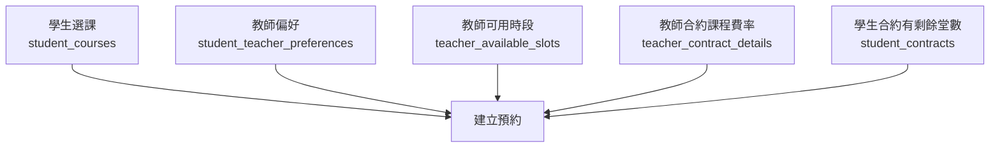
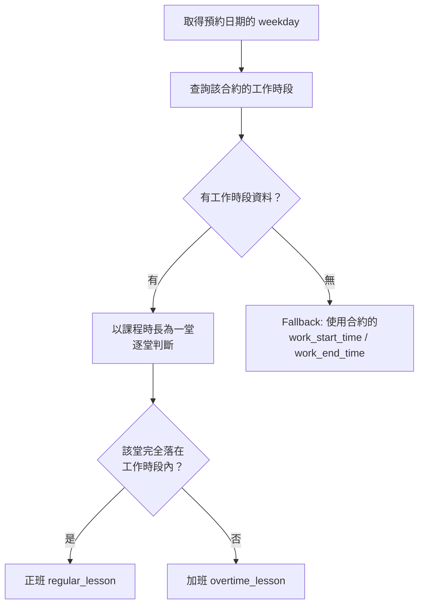
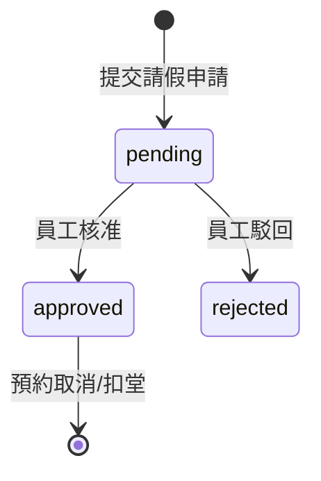

# EOP 教學管理平台 — 正職教師完整流程

## 總覽

正職教師（`employment_type = full_time`）與時薪教師的差異在於：有固定底薪、津貼、工作時段排班，以及加班費計算機制。


---

## 一、建立教師

> **權限**: `teachers.create`（僅員工）

**API**: `POST /api/v1/teachers`

| 欄位 | 必填 | 說明 |
|------|------|------|
| `teacher_no` | 選填 | 留空自動產生 `EOPT{序號}` |
| `name` | 必填 | 教師姓名 |
| `email` | 必填 | 唯一，用於登入 |
| `phone` | 選填 | 電話 |
| `teacher_level` | 選填 | 教師等級（預設 1），用於學生偏好篩選 |

教師建立後，需透過 **邀請連結** 讓教師設定密碼並啟用帳號。

---

## 二、建立正職合約

> **權限**: `teachers.contracts`（僅員工）

**API**: `POST /api/v1/teacher-contracts`

```json
{
    "teacher_id": "uuid",
    "contract_status": "active",
    "start_date": "2026-04-01",
    "end_date": "2027-03-31",
    "employment_type": "full_time",
    "trial_completed_bonus": 300,
    "trial_to_formal_bonus": 600,
    "notes": "正職合約"
}
```

### 關鍵規則

- 每位教師同時只能有 **一份生效中合約**（`contract_status = active`）
- 合約編號自動產生：`TC{YYYYMMDD}{序號}`
- 正職合約啟用後，需進一步設定：合約明細、工作時段

### 合約狀態流程



### 正職 vs 時薪合約差異

| 項目 | 正職 (`full_time`) | 時薪 (`hourly`) |
|------|-------------------|-----------------|
| 合約明細 | 底薪、津貼、課程時薪、加班費 | 僅課程時薪 |
| 工作時段 | 必須設定 | 不需要 |
| 合計金額 | 底薪 + 津貼 合計 | 無 |
| 加班判定 | 有（依工作時段計算） | 無 |
| 試上獎金 | 可設定 | 可設定 |

---

## 三、合約明細

> **權限**: `teachers.contracts`（僅員工）

**API**: `POST /api/v1/teacher-contracts/{contract_id}/details`

正職合約支援四種明細類型：

### 3.1 課程時薪 (`course_rate`)

每位教師對每門課程的教學費率。建立預約時，系統自動從此處帶入 `teacher_hourly_rate`。

```json
{
    "detail_type": "course_rate",
    "course_id": "uuid",
    "description": "一對一教學",
    "amount": 800
}
```

- 同合約 + 同課程 **不可重複**（unique index）
- `course_id` 為必填

### 3.2 底薪 (`base_salary`)

正職教師的月薪基礎。

```json
{
    "detail_type": "base_salary",
    "description": "基本底薪",
    "amount": 30000
}
```

### 3.3 津貼 (`allowance`)

交通津貼、餐費等額外津貼。可新增多筆。

```json
{
    "detail_type": "allowance",
    "description": "交通津貼",
    "amount": 2000
}
```

### 3.4 加班費 (`overtime_rate`)

當上課時間落在工作時段外（加班），系統依此費率計算加班費。

```json
{
    "detail_type": "overtime_rate",
    "description": "平日加班費",
    "amount": 150,
    "notes": "每堂加班 150 元"
}
```

**重要規則：每份合約只能設定一筆加班費，不可重複。**

- DB 層：`UNIQUE partial index` 限制同合約只能有一筆 `overtime_rate`
- API 層：新增時檢查是否已存在
- 前端：下拉選項在已設定時顯示 **「加班費（已設定）」** 並禁用

### 合計金額

前端顯示的「合計金額」= 所有 `base_salary` + `allowance` 的金額加總（不含 `course_rate` 和 `overtime_rate`）。

---

## 四、工作時段設定

> **權限**: `teachers.contracts`（僅員工）

**API**: `PUT /api/v1/teacher-contracts/{contract_id}/work-schedules`

定義教師每週的正常工作時間，用於判斷預約是正班還是加班。

```json
{
    "schedules": [
        { "weekday": 0, "start_time": "09:00", "end_time": "12:00" },
        { "weekday": 0, "start_time": "13:00", "end_time": "17:00" },
        { "weekday": 1, "start_time": "09:00", "end_time": "17:00" },
        { "weekday": 2, "start_time": "09:00", "end_time": "17:00" },
        { "weekday": 3, "start_time": "09:00", "end_time": "17:00" },
        { "weekday": 4, "start_time": "09:00", "end_time": "12:00" }
    ]
}
```

### 格式說明

| weekday | 對應 |
|---------|------|
| 0 | 週一 |
| 1 | 週二 |
| 2 | 週三 |
| 3 | 週四 |
| 4 | 週五 |
| 5 | 週六 |
| 6 | 週日 |

- 同一天可以有 **多個時段**（例如上午 + 下午，中間休息）
- 全量替換：每次送出會覆蓋該合約所有工作時段
- 驗證：`start_time` 必須小於 `end_time`，同天不可重疊

---

## 五、開放可預約時段

> **權限**: `teachers.slots`（僅員工）

**API**: `POST /api/v1/teacher-slots`

教師在特定日期開放可供學生預約的時段。

```json
{
    "teacher_id": "uuid",
    "teacher_contract_id": "uuid",
    "slot_date": "2026-04-20",
    "start_time": "08:00",
    "end_time": "18:00",
    "is_available": true
}
```

- 一個 slot 內可包含多筆 30 分鐘區塊
- 學生預約時系統會自動匹配可用 slot
- 支援批次建立（`POST /api/v1/teacher-slots/batch`）

---

## 六、學生預約上課

> **權限**: `bookings.create`

### 前置條件

預約前需完成以下設定：



### 建立預約

**API**: `POST /api/v1/bookings`

```json
{
    "student_id": "uuid",
    "teacher_id": "uuid",
    "course_id": "uuid",
    "student_contract_id": "uuid",
    "teacher_contract_id": "uuid",
    "booking_date": "2026-04-20",
    "start_time": "09:00",
    "end_time": "10:00"
}
```

### 系統自動處理

1. 計算 `lessons_used` = 預約時長 / 課程單堂時長
2. 從教師合約明細帶入 `teacher_hourly_rate`（課程費率）
3. 扣除學生合約的 `remaining_lessons`
4. 更新 slot 的 `is_booked` 狀態
5. 產生預約編號 `BK{YYYYMMDD}{序號}`

### 批次預約

**API**: `POST /api/v1/bookings/batch`

支援在日期範圍 + 指定週幾自動建立多筆預約（上限三個月）。

---

## 七、正班 / 加班判定

預約建立後，系統會根據教師的工作時段自動判定每堂課是正班還是加班。

### 判定演算法



### 範例

假設教師工作時段為 **週一 09:00–12:00**，課程時長 60 分鐘：

| 預約時間 | 堂數拆分 | 結果 |
|----------|---------|------|
| 09:00–10:00 | 1 堂 | `regular_lessons=1, overtime_lessons=0` |
| 11:00–13:00 | 2 堂 | `regular_lessons=1, overtime_lessons=1`（11:00-12:00 正班、12:00-13:00 加班）|
| 13:00–14:00 | 1 堂 | `regular_lessons=0, overtime_lessons=1` |
| 09:00–12:00 | 3 堂 | `regular_lessons=3, overtime_lessons=0` |

---

## 八、加班費計算

當預約有加班堂數，且教師合約設有加班費（`overtime_rate`），系統自動計算加班費。

### 計算公式

```
overtime_pay = overtime_lessons × overtime_rate
```

### 範例

| 設定 | 值 |
|------|-----|
| 加班費率 | 150 元/堂 |
| 課程時薪 | 800 元/堂 |
| 工作時段 | 09:00–12:00 |

| 預約 | 正班 | 加班 | overtime_pay | 說明 |
|------|------|------|-------------|------|
| 09:00–10:00 | 1 | 0 | `null` | 完全在工作時段內，無加班費 |
| 13:00–14:00 | 0 | 1 | `150` | 完全在工作時段外 |
| 11:00–13:00 | 1 | 1 | `150` | 1 堂正班 + 1 堂加班 |
| 13:00–15:00 | 0 | 2 | `300` | 2 堂加班 |

### API 回應欄位

```json
{
    "id": "uuid",
    "booking_no": "BK20260420001",
    "teacher_hourly_rate": 800,
    "booking_date": "2026-04-20",
    "start_time": "13:00:00",
    "end_time": "14:00:00",
    "lessons_used": 1,
    "is_overtime": true,
    "regular_lessons": 0,
    "overtime_lessons": 1,
    "overtime_pay": 150.0
}
```

### 效能設計

- **單筆查詢**（`GET /bookings/{id}`）：逐筆查詢合約 → 工作時段 → 加班費率
- **列表查詢**（`GET /bookings`）：批次一次取得所有全職教師的工作時段與加班費率，避免 N+1 問題

---

## 九、請假流程

> **權限**: `leave.manage`（教師/學生），`leave.approve`（僅員工）

**API**: `POST /api/v1/leave-records`

教師或學生可針對已建立的預約申請請假。



| 欄位 | 說明 |
|------|------|
| `booking_id` | 對應的預約 |
| `leave_type` | `absence`（缺席）或 `leave`（請假）|
| `initiator_type` | `student` 或 `teacher` |
| `deduct_lesson` | 是否扣除學生堂數 |

預約列表中會顯示 `has_pending_leave` 和 `pending_leave_initiator_type`，方便員工審核。

---

## 十、代課教師

> **權限**: `bookings.edit`（僅員工）

**API**: `POST /api/v1/substitute-details`

已確認的預約可指派代課教師。

```json
{
    "booking_id": "uuid",
    "substitute_teacher_id": "uuid",
    "substitute_contract_id": "uuid"
}
```

### 驗證規則

1. 預約狀態必須是 `confirmed`
2. 代課教師不可與原教師相同
3. 代課教師必須有可用時段涵蓋預約時間
4. 代課合約必須有該課程的 `course_rate`
5. 代課教師該時段不可有衝突預約

### 預約回應

代課教師的名稱會出現在 `substitute_teacher_name` 欄位。加班判定仍依原教師的工作時段計算。

---

## 十一、教師獎金

> **權限**: `teachers.bonus`

**API**: `POST /api/v1/teacher-bonus`

### 獎金類型

| 類型 | 觸發方式 | 說明 |
|------|---------|------|
| `trial_completed` | 自動 | 試上預約完成時，依合約 `trial_completed_bonus` 金額建立 |
| `trial_to_formal` | 自動 | 學生試上轉正時，依合約 `trial_to_formal_bonus` 金額建立 |
| `performance` | 手動 | 績效獎金 |
| `substitute` | 手動 | 代課獎金 |
| `referral` | 手動 | 推薦獎金 |
| `other` | 手動 | 其他 |

### 自動觸發邏輯

當預約狀態更新為 `completed` 且為 `trial` 類型時：
1. 查詢教師合約的 `trial_completed_bonus`
2. 自動建立一筆 `trial_completed` 獎金記錄
3. 關聯 `related_booking_id` 和 `related_student_id`

---

## 十二、合約附約

> **權限**: `teachers.contracts`（僅員工）

**API**: `POST /api/v1/teacher-contracts/{contract_id}/addendums`

用於延長合約期限或修改條款，保留原合約審計紀錄。

```json
{
    "original_end_date": "2027-03-31",
    "new_end_date": "2027-09-30",
    "addendum_status": "active",
    "notes": "展延半年"
}
```

- 附約編號自動產生：`{原合約編號}-A{序號}`
- 支援上傳附約檔案（PDF/DOCX）
- 支援產生附約 PDF

---

## 權限總覽

| 操作 | 權限 | 可操作角色 |
|------|------|-----------|
| 建立教師 | `teachers.create` | 員工 |
| 查看教師 | `teachers.list` | 員工、教師（自己）、學生（有限） |
| 建立/管理合約 | `teachers.contracts` | 員工 |
| 教師查看自己的合約 | `teachers.contracts` | 教師（僅自己） |
| 管理合約明細 | `teachers.contracts` | 員工 |
| 管理工作時段 | `teachers.contracts` | 員工 |
| 管理教師時段 | `teachers.slots` | 員工 |
| 建立預約 | `bookings.create` | 員工、學生（僅自己） |
| 查看預約 | `bookings.list` | 員工、教師（自己+代課）、學生（自己） |
| 指派代課 | `bookings.edit` | 員工 |
| 請假申請 | `leave.manage` | 教師、學生 |
| 請假審核 | `leave.approve` | 員工 |
| 管理獎金 | `teachers.bonus` | 員工 |
| 教師查看獎金 | `teachers.bonus` | 教師（僅自己） |

---

## DB Schema 重點

### teacher_contracts

```sql
employment_type: 'hourly' | 'full_time'
trial_completed_bonus: DECIMAL(10,2)
trial_to_formal_bonus: DECIMAL(10,2)
work_start_time: TIME  -- (deprecated, 改用 teacher_work_schedules)
work_end_time: TIME    -- (deprecated, 改用 teacher_work_schedules)
```

### teacher_contract_details

```sql
detail_type: 'course_rate' | 'base_salary' | 'allowance' | 'overtime_rate'
-- course_rate: 必須指定 course_id
-- overtime_rate: 每合約限一筆（UNIQUE partial index）
```

### teacher_work_schedules

```sql
teacher_contract_id UUID
weekday INT  -- 0=週一, 6=週日
start_time TIME
end_time TIME
```

### bookings 回應欄位（正職教師專用）

```sql
is_overtime: BOOLEAN       -- 是否有加班堂數
regular_lessons: INT       -- 正班堂數
overtime_lessons: INT      -- 加班堂數
overtime_pay: FLOAT        -- 加班費 = overtime_lessons × overtime_rate
teacher_hourly_rate: DECIMAL  -- 課程費率（來自 contract_details）
```
