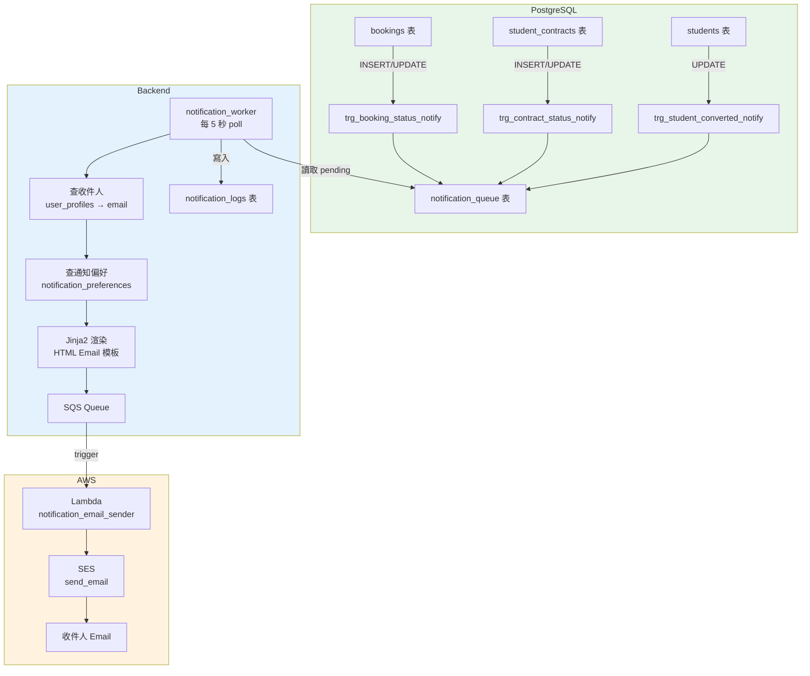
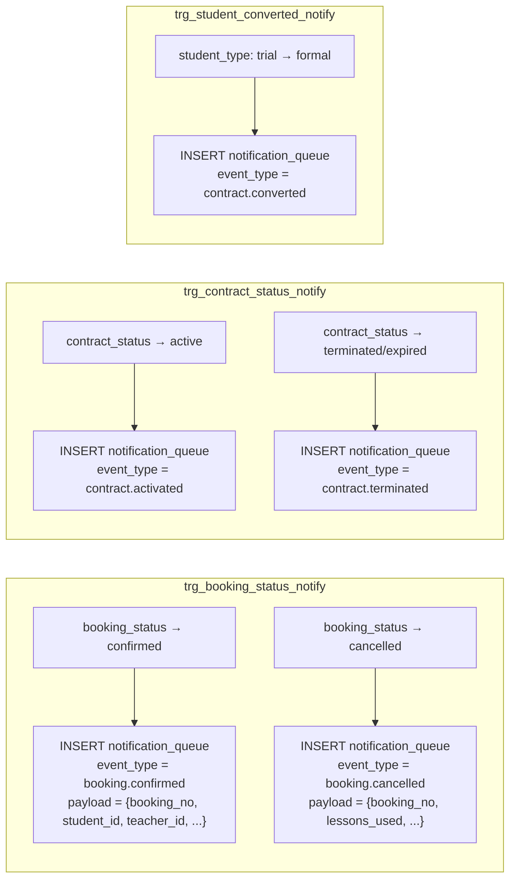
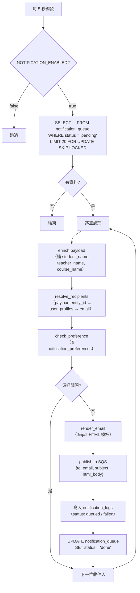

# 通知模組 — 事件驅動 Email 通知

> 建立日期：2026-04-02
> 架構更新：2026-04-03（改為 DB trigger → SQS → Lambda → SES 完全解耦架構）

## 一、目標

建立可擴充的事件驅動通知模組，當系統發生特定事件時，透過 AWS SQS + Lambda + SES 發送 Email 通知給相關人員。**API 程式碼零改動**。

---

## 二、架構設計

### 2.1 架構圖



### 2.2 資料流（文字版）

```
API 端點（不改動）
    ↓ INSERT / UPDATE
PostgreSQL 表
    ↓ DB trigger 自動偵測狀態變更
notification_queue（status = pending）
    ↓ Backend worker 每 5 秒 poll
    ↓ 1. 領取 pending → processing（FOR UPDATE SKIP LOCKED）
    ↓ 2. 查收件人 email（user_profiles JOIN users）
    ↓ 3. 查通知偏好（notification_preferences）
    ↓ 4. Jinja2 渲染 HTML 模板
    ↓ 5. Publish 完整 email payload 到 SQS
    ↓ 6. 寫入 notification_logs
    ↓ 7. 標記 queue status = done
AWS SQS
    ↓ Lambda trigger（批次處理）
Lambda
    ↓ SES send_email
收件人信箱
```

### 2.3 各層職責

| 層 | 元件 | 職責 | 可替換性 |
|---|------|------|---------|
| DB | PostgreSQL trigger | 偵測狀態變更 → 寫入 notification_queue | 不可替換（核心） |
| Backend | notification_worker | 讀 queue → 查收件人/偏好 → 渲染模板 → SQS publish → log | 可替換為獨立 worker process |
| Backend | notification_service | 收件人解析、偏好查詢、模板渲染（純 prepare，不寄送） | - |
| AWS | SQS | 訊息佇列，緩衝 + 自動重試 + DLQ | 可替換為 RabbitMQ 等 |
| AWS | Lambda | 純寄送：收 SQS message → SES | 可替換為任何 consumer |
| AWS | SES | Email 實際寄送 | 可替換為 SendGrid 等 |

### 2.4 設計原則

| 原則 | 說明 |
|------|------|
| **API 零改動** | 新增事件只加 SQL trigger，不動 Python API 程式碼 |
| **不會漏發** | DB 層攔截，不管哪個 API 或直接 SQL 改狀態都會觸發 |
| **Lambda 無需 DB 連線** | Worker 已準備好完整 `{to_email, subject, html_body}` |
| **SQS 自帶重試** | 寄送失敗 Lambda 回報 batchItemFailures，SQS 自動重試 |
| **Feature toggle** | `NOTIFICATION_ENABLED=false` 時 worker 完全不跑 |
| **使用者可控** | notification_preferences 讓使用者選擇接收哪些通知 |
| **完整記錄** | 每次處理都寫 notification_logs（queued / failed / dry_run） |

---

## 三、事件類型

### 3.1 已實作（5 種）

| 事件 | event_type | DB trigger | 觸發條件 |
|------|-----------|------------|---------|
| 預約確認 | `booking.confirmed` | `trg_booking_status_notify` | booking_status → confirmed |
| 預約取消 | `booking.cancelled` | `trg_booking_status_notify` | booking_status → cancelled |
| 合約啟動 | `contract.activated` | `trg_contract_status_notify` | contract_status → active |
| 合約終止 | `contract.terminated` | `trg_contract_status_notify` | contract_status → terminated / expired |
| 試上轉正 | `contract.converted` | `trg_student_converted_notify` | student_type: trial → formal |

### 3.2 各事件收件人與通知內容

| 事件 | 收件人 | Email 主旨 | 關鍵內容 |
|------|--------|-----------|---------|
| booking.confirmed | 學生 + 教師 | 課程預約已確認 | 預約編號、日期時間、課程、教師、學生 |
| booking.cancelled | 學生 + 教師 | 課程預約已取消 | 預約編號、日期時間、退回堂數 |
| contract.activated | 學生 | 您的課程合約已啟動 | 合約編號、總堂數、有效期間 |
| contract.terminated | 學生 | 合約終止通知 | 合約編號、剩餘堂數 |
| contract.converted | 學生 | 恭喜！試上已轉為正式課程 | 學生姓名、合約資訊 |

### 3.3 擴充方式

新增一種通知事件只需 3 步：

1. **加 SQL trigger**（`supabase/migrations/` 新增 migration）
2. **加 Email 模板**（`backend/app/templates/email/xxx.html`）
3. **在 notification_service.py 的 `_EVENT_CONFIG` 加一行設定**

不需要動任何 API 程式碼。

### 3.4 未來可擴充事件

```
booking.reminder       — 上課提醒（排程觸發）
booking.completed      — 課堂完成
leave.submitted        — 請假申請提交
leave.approved         — 請假核准
substitute.assigned    — 代課指派
account.invited        — 邀請註冊
account.password_reset — 密碼重設
```

---

## 四、檔案結構

```
EOP/
├── backend/app/
│   ├── services/
│   │   ├── notification_worker.py     # 背景 worker：poll queue → enrich → SQS
│   │   └── notification_service.py    # 純 prepare：查收件人/偏好、渲染模板
│   ├── models/
│   │   └── notification_event.py      # 事件類型 enum + dataclass
│   ├── templates/email/
│   │   ├── base.html                  # 共用 layout（header/footer）
│   │   ├── booking_confirmed.html
│   │   ├── booking_cancelled.html
│   │   ├── contract_activated.html
│   │   ├── contract_converted.html
│   │   └── contract_terminated.html
│   └── api/v1/
│       └── notifications.py           # GET/PUT /notifications/preferences
├── lambda/
│   └── notification_email_sender/
│       ├── lambda_function.py         # SQS → SES 寄送
│       └── deploy.sh                  # 部署腳本
└── supabase/migrations/
    ├── 047_notification_logs_and_preferences.sql
    └── 048_notification_queue_triggers.sql
```

---

## 五、DB trigger 設計

### 5.1 notification_queue 表

```sql
CREATE TABLE notification_queue (
    id UUID PRIMARY KEY DEFAULT uuid_generate_v4(),
    event_type VARCHAR(50) NOT NULL,      -- 'booking.confirmed' 等
    reference_id UUID NOT NULL,           -- 關聯的 booking / contract / student ID
    reference_type VARCHAR(50) NOT NULL,  -- 'booking', 'student_contract', 'student'
    payload JSONB NOT NULL DEFAULT '{}',  -- trigger 自動組裝的事件資料
    status VARCHAR(20) DEFAULT 'pending', -- pending → processing → done / failed
    created_at TIMESTAMPTZ DEFAULT NOW(),
    processed_at TIMESTAMPTZ
);
```

### 5.2 Trigger 設計

每個 trigger function 在偵測到狀態變更時，自動將相關資料序列化為 JSONB 寫入 queue：



### 5.3 Trigger payload 範例

預約確認時，trigger 自動組裝：

```json
{
    "booking_no": "BK20260402001",
    "student_id": "uuid-...",
    "teacher_id": "uuid-...",
    "course_id": "uuid-...",
    "booking_date": "2026-04-05",
    "start_time": "14:00:00",
    "end_time": "15:00:00"
}
```

Worker 會進一步 enrich 為：

```json
{
    "booking_no": "BK20260402001",
    "student_id": "uuid-...",
    "student_name": "王小明",
    "teacher_id": "uuid-...",
    "teacher_name": "John",
    "course_id": "uuid-...",
    "course_name": "英語會話",
    "booking_date": "2026-04-05",
    "start_time": "14:00",
    "end_time": "15:00"
}
```

---

## 六、Backend Worker 流程



### Worker 防重複處理

使用 PostgreSQL `FOR UPDATE SKIP LOCKED` 確保：
- 多個 worker instance 不會重複處理同一筆
- 處理中的項目不會被其他 worker 領取

---

## 七、Lambda 函式

### 7.1 職責

Lambda 只做一件事：**收 SQS message → SES send_email**。

所有業務邏輯（查收件人、偏好、渲染模板）都在 Backend worker 完成，Lambda 收到的是完整的 email payload：

```json
{
    "to_email": "student@example.com",
    "subject": "[EOP] 課程預約已確認",
    "html_body": "<html>完整 HTML...</html>",
    "event_type": "booking.confirmed",
    "reference_id": "uuid-...",
    "user_id": "uuid-..."
}
```

### 7.2 失敗重試

Lambda 使用 `batchItemFailures` 回報失敗的 record，SQS 會自動重試。建議設定：

| 參數 | 值 | 說明 |
|------|-----|------|
| Visibility Timeout | 60s | Lambda 處理時間上限 |
| Max Receive Count | 3 | 最多重試 3 次 |
| DLQ | eop-notification-dlq | 3 次失敗後移入 Dead Letter Queue |

---

## 八、資料庫表

### 8.1 notification_queue（事件佇列）

| 欄位 | 類型 | 說明 |
|------|------|------|
| id | UUID PK | |
| event_type | VARCHAR(50) | booking.confirmed 等 |
| reference_id | UUID | 關聯的 booking/contract/student ID |
| reference_type | VARCHAR(50) | booking, student_contract, student |
| payload | JSONB | trigger 自動組裝的事件資料 |
| status | VARCHAR(20) | pending → processing → done / failed |
| created_at | TIMESTAMPTZ | |
| processed_at | TIMESTAMPTZ | worker 領取時間 |

### 8.2 notification_logs（寄送紀錄）

| 欄位 | 類型 | 說明 |
|------|------|------|
| id | UUID PK | |
| user_id | UUID FK | 收件人 user |
| recipient_email | VARCHAR(255) | 收件 email |
| channel | VARCHAR(20) | email（擴充用：line, sms） |
| event_type | VARCHAR(50) | 事件類型 |
| subject | VARCHAR(255) | Email 主旨 |
| notification_status | VARCHAR(20) | queued / failed |
| error_message | TEXT | 失敗原因 |
| reference_id | UUID | 關聯 ID |
| reference_type | VARCHAR(50) | 關聯類型 |
| sent_at | TIMESTAMPTZ | |
| created_at | TIMESTAMPTZ | |

### 8.3 notification_preferences（使用者偏好）

| 欄位 | 類型 | 說明 |
|------|------|------|
| id | UUID PK | |
| user_id | UUID UNIQUE FK | |
| email_enabled | BOOLEAN | 全域開關（預設 true） |
| booking_confirmed | BOOLEAN | 預約確認通知 |
| booking_cancelled | BOOLEAN | 預約取消通知 |
| contract_activated | BOOLEAN | 合約啟動通知 |
| contract_converted | BOOLEAN | 試上轉正通知 |
| contract_terminated | BOOLEAN | 合約終止通知 |

---

## 九、環境變數

```env
# Email 通知（SQS → Lambda → SES）
NOTIFICATION_ENABLED=false              # 功能開關，false 時 worker 不運行
NOTIFICATION_SQS_QUEUE_URL=             # SQS queue URL（留空 = dry-run 只寫 log）
AWS_SES_SENDER_EMAIL=noreply@eop-system.com  # SES 寄件者（需在 SES 驗證）
```

- `NOTIFICATION_ENABLED=false`：worker 完全不跑，不讀 queue
- `NOTIFICATION_ENABLED=true` + `NOTIFICATION_SQS_QUEUE_URL=`（空）：worker 讀 queue、寫 log，但 SQS publish 為 dry-run
- `NOTIFICATION_ENABLED=true` + `NOTIFICATION_SQS_QUEUE_URL=https://...`：完整流程

---

## 十、AWS 資源設定（一次性）

### 10.1 SQS Queue

```bash
# 建立通知佇列
aws sqs create-queue \
  --queue-name eop-notification-email \
  --region ap-northeast-1

# 建立 Dead Letter Queue
aws sqs create-queue \
  --queue-name eop-notification-email-dlq \
  --region ap-northeast-1

# 設定 DLQ（maxReceiveCount = 3）
aws sqs set-queue-attributes \
  --queue-url <QUEUE_URL> \
  --attributes '{"RedrivePolicy":"{\"deadLetterTargetArn\":\"<DLQ_ARN>\",\"maxReceiveCount\":\"3\"}"}'
```

### 10.2 SES 設定

```bash
# 驗證寄件者 Email（開發環境）
aws ses verify-email-identity --email-address noreply@eop-system.com

# 驗證網域（正式環境）
aws ses verify-domain-identity --domain eop-system.com

# 檢查是否仍在 sandbox（sandbox 只能寄給已驗證的 email）
aws ses get-account --query 'ProductionAccessEnabled'
# false → 需申請 production access
```

### 10.3 Lambda 函式

```bash
cd lambda/notification_email_sender

# 建立 Lambda
aws lambda create-function \
  --function-name eop-notification-email-sender \
  --runtime python3.12 \
  --handler lambda_function.lambda_handler \
  --role arn:aws:iam::ACCOUNT_ID:role/eop-lambda-ses-role \
  --environment "Variables={SES_SENDER_EMAIL=noreply@eop-system.com}" \
  --zip-file fileb://function.zip \
  --region ap-northeast-1

# 設定 SQS trigger
aws lambda create-event-source-mapping \
  --function-name eop-notification-email-sender \
  --event-source-arn <SQS_QUEUE_ARN> \
  --batch-size 10 \
  --function-response-types ReportBatchItemFailures
```

### 10.4 IAM Role（Lambda 用）

```json
{
  "Version": "2012-10-17",
  "Statement": [
    {
      "Effect": "Allow",
      "Action": ["ses:SendEmail"],
      "Resource": "*"
    },
    {
      "Effect": "Allow",
      "Action": ["sqs:ReceiveMessage", "sqs:DeleteMessage", "sqs:GetQueueAttributes"],
      "Resource": "<SQS_QUEUE_ARN>"
    },
    {
      "Effect": "Allow",
      "Action": ["logs:CreateLogGroup", "logs:CreateLogStream", "logs:PutLogEvents"],
      "Resource": "arn:aws:logs:*:*:*"
    }
  ]
}
```

---

## 十一、通知偏好 API

| 端點 | 方法 | 說明 |
|------|------|------|
| `/api/v1/notifications/preferences` | GET | 取得我的通知偏好 |
| `/api/v1/notifications/preferences` | PUT | 更新我的通知偏好 |

Request / Response body：

```json
{
    "email_enabled": true,
    "booking_confirmed": true,
    "booking_cancelled": true,
    "contract_activated": true,
    "contract_converted": true,
    "contract_terminated": true
}
```

---

## 十二、Email 模板

所有模板使用 Jinja2 繼承 `base.html` 共用 layout，包含：
- Header（藍色背景 + 標題）
- Body（info-table 格式顯示資訊）
- Footer（系統自動通知聲明）

| 模板檔案 | 事件 |
|---------|------|
| `base.html` | 共用 layout |
| `booking_confirmed.html` | 預約確認 |
| `booking_cancelled.html` | 預約取消 |
| `contract_activated.html` | 合約啟動 |
| `contract_converted.html` | 試上轉正 |
| `contract_terminated.html` | 合約終止 |

---

## 十三、Migration 檔案

| Migration | 說明 |
|-----------|------|
| `047_notification_logs_and_preferences.sql` | notification_logs + notification_preferences 表 |
| `048_notification_queue_triggers.sql` | notification_queue 表 + 3 個 DB trigger function |

---

## 十四、程式碼位置

| 檔案 | 說明 |
|------|------|
| `backend/app/services/notification_worker.py` | 背景 worker：poll queue → enrich → SQS publish → log |
| `backend/app/services/notification_service.py` | 純 prepare：查收件人/偏好、Jinja2 渲染模板 |
| `backend/app/models/notification_event.py` | NotificationEventType enum + NotificationEvent dataclass |
| `backend/app/api/v1/notifications.py` | 通知偏好 API（GET/PUT） |
| `backend/app/templates/email/*.html` | Jinja2 Email HTML 模板 |
| `backend/app/config.py` | NOTIFICATION_ENABLED, NOTIFICATION_SQS_QUEUE_URL, AWS_SES_SENDER_EMAIL |
| `backend/app/main.py` | 啟動 notification_worker_loop 背景任務 |
| `lambda/notification_email_sender/lambda_function.py` | Lambda：SQS → SES 寄送 |
| `lambda/notification_email_sender/deploy.sh` | Lambda 部署腳本 |
