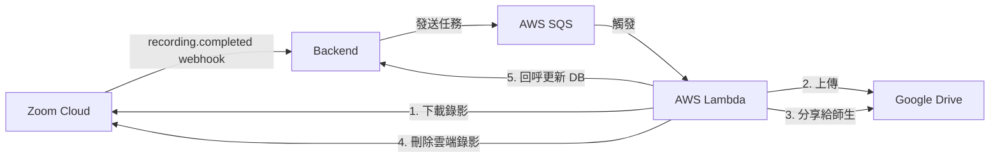
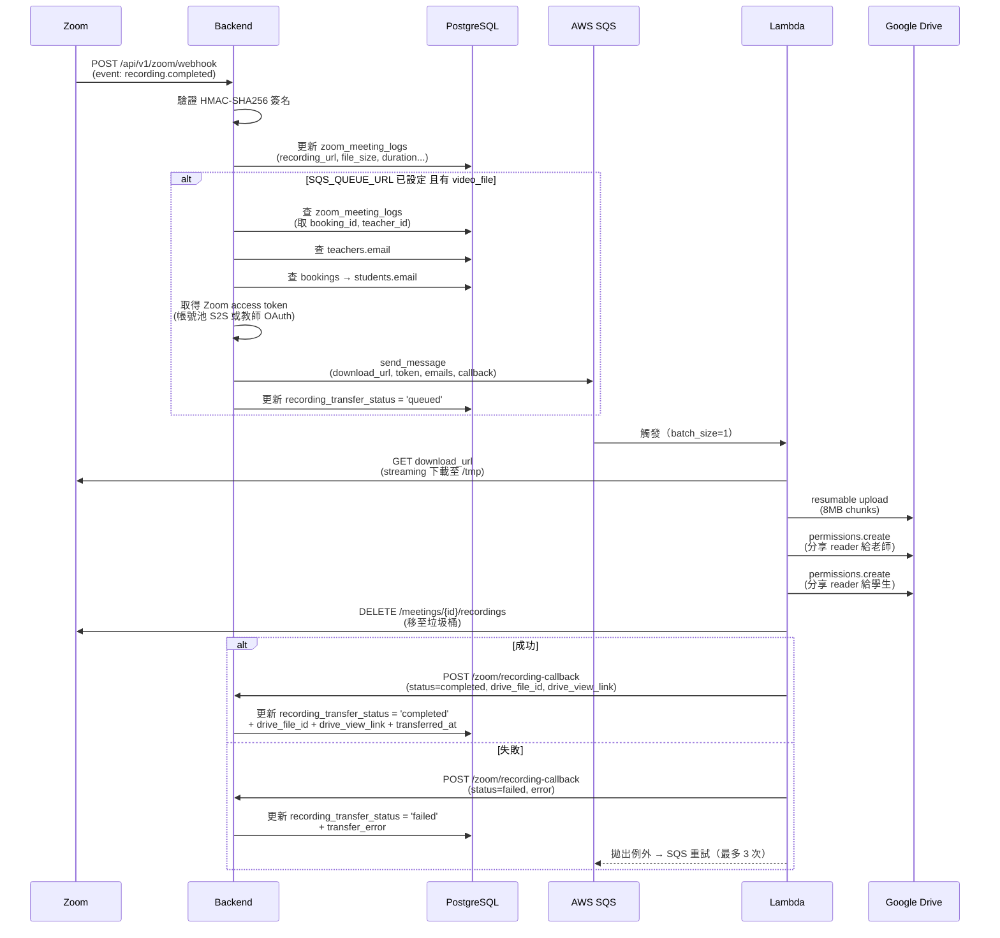
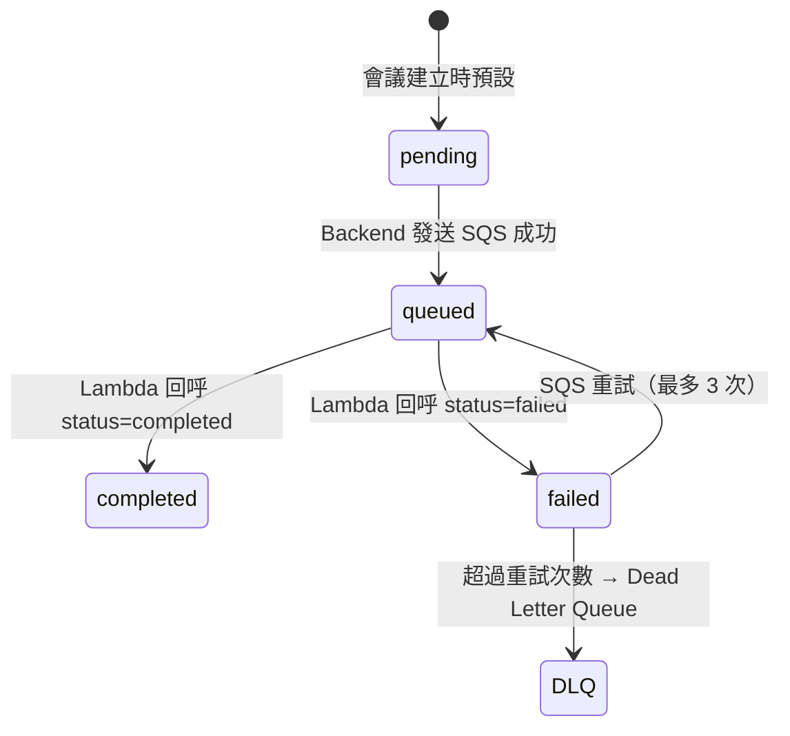

# Zoom 錄影自動上傳 Google Drive

Zoom 雲端錄影有儲存空間限制且下載 URL 會過期。本功能在 `recording.completed` webhook 觸發後，自動將錄影檔下載並上傳至 Google Drive 保存，並分享給該堂課的老師和學生。

## 架構總覽



## 執行流程

### 完整時序圖



### 狀態流轉



`recording_transfer_status` 欄位值：

| 狀態 | 說明 |
|------|------|
| `pending` | 預設值，尚未觸發轉移 |
| `queued` | 已發送 SQS，等待 Lambda 處理 |
| `completed` | Google Drive 上傳完成 |
| `failed` | 轉移失敗（錯誤訊息記錄在 `transfer_error`） |

## 步驟說明

### Step 1: Zoom Webhook 觸發

- 端點：`POST /api/v1/zoom/webhook`
- 事件：`recording.completed`
- 檔案：`backend/app/api/v1/zoom.py`
- 處理：`zoom_service.handle_recording_completed()` 寫入錄影 metadata 後，呼叫 `_enqueue_recording_transfer()`

### Step 2: Backend 查詢 email + 發送 SQS

- 檔案：`backend/app/services/zoom_service.py` → `_enqueue_recording_transfer()`
- 查詢路徑：
  - `zoom_meeting_logs` → `teacher_id` → `teachers.email`
  - `zoom_meeting_logs` → `booking_id` → `bookings.student_id` → `students.email`
- 取得 Zoom token（帳號池 S2S 或教師 OAuth），供 Lambda 下載用
- SQS message payload：

```json
{
  "meeting_id": "123456789",
  "download_url": "https://zoom.us/rec/download/...",
  "file_type": "MP4",
  "file_size": 314572800,
  "zoom_access_token": "eyJ...",
  "share_emails": ["teacher@gmail.com", "student@gmail.com"],
  "callback_url": "https://api.example.com/api/v1/zoom/recording-callback",
  "callback_secret": "random-secret"
}
```

### Step 3: Lambda 處理

- 檔案：`lambda/zoom-recording-downloader/handler.py`
- 依序執行：
  1. **下載**：Streaming GET 從 Zoom 下載到 `/tmp`（1MB chunks）
  2. **上傳**：Resumable upload 到 Google Drive 指定資料夾（8MB chunks）
  3. **分享**：對每個 email 建立 reader permission
  4. **刪除 Zoom 錄影**：移至 Zoom 垃圾桶（30 天後自動永久刪除）
  5. **清理 /tmp**
  6. **回呼 Backend**：POST callback URL 回報結果

### Step 4: Backend 回呼端點

- 端點：`POST /api/v1/zoom/recording-callback`
- 檔案：`backend/app/api/v1/zoom.py` → `recording_callback()`
- 驗證：`secret` 欄位須匹配 `RECORDING_CALLBACK_SECRET`
- 更新 `zoom_meeting_logs`：
  - 成功：`drive_file_id`, `drive_view_link`, `transferred_at`, `recording_transfer_status=completed`
  - 失敗：`transfer_error`, `recording_transfer_status=failed`

## 相關檔案

| 檔案 | 說明 |
|------|------|
| `backend/app/services/zoom_service.py` | `_enqueue_recording_transfer()` + `_get_token_for_download()` |
| `backend/app/services/sqs_service.py` | SQS 客戶端封裝（boto3 singleton） |
| `backend/app/api/v1/zoom.py` | `/recording-callback` 回呼端點 |
| `backend/app/schemas/zoom.py` | `RecordingCallbackRequest` schema |
| `backend/app/config.py` | `SQS_QUEUE_URL`, `RECORDING_CALLBACK_SECRET`, `BACKEND_BASE_URL` |
| `lambda/zoom-recording-downloader/handler.py` | Lambda 主程式 |
| `lambda/zoom-recording-downloader/requirements.txt` | Lambda 依賴 |
| `lambda/zoom-recording-downloader/deploy.sh` | Lambda 打包 + 部署 |
| `scripts/setup-sqs-lambda.sh` | AWS 資源建立腳本 |
| `supabase/migrations/038_recording_transfer_status.sql` | DB migration |

## DB 欄位（zoom_meeting_logs）

| 欄位 | 型別 | 說明 |
|------|------|------|
| `recording_transfer_status` | VARCHAR(20) | `pending` / `queued` / `completed` / `failed` |
| `drive_file_id` | TEXT | Google Drive 檔案 ID |
| `drive_view_link` | TEXT | Google Drive 檢視連結 |
| `transfer_error` | TEXT | 失敗錯誤訊息 |
| `transferred_at` | TIMESTAMPTZ | 轉移完成時間 |

## AWS 資源

| 資源 | 名稱 | 設定 |
|------|------|------|
| SQS Queue | `zoom-recording-download` | VisibilityTimeout=960s, MaxReceiveCount=3 |
| SQS DLQ | `zoom-recording-download-dlq` | 失敗訊息最終歸屬 |
| IAM Role | `zoom-recording-lambda-role` | Lambda 執行 + SQS receive/delete |
| Lambda | `zoom-recording-downloader` | Python 3.12, 1024MB RAM, 2048MB /tmp, 900s timeout |

## Lambda 環境變數

| 變數 | 說明 |
|------|------|
| `GOOGLE_DRIVE_FOLDER_ID` | Google Drive 目標資料夾 ID |
| `GOOGLE_SA_CREDENTIALS` | Service Account JSON（base64 encoded） |

## 環境變數（Backend .env）

| 變數 | 說明 |
|------|------|
| `SQS_QUEUE_URL` | SQS queue URL（空值 = 停用錄影轉移功能） |
| `RECORDING_CALLBACK_SECRET` | Lambda 回呼驗證密鑰 |
| `BACKEND_BASE_URL` | Backend 對外 URL（供 Lambda 回呼用） |

## 部署步驟

```bash
# 1. Google Cloud 前置
#    - 建立 Service Account + 啟用 Drive API
#    - 將 SA email 加為 Drive 資料夾編輯者
#    - base64 encode credentials JSON

# 2. DB migration
docker compose up --build migrations -d

# 3. AWS 資源
bash scripts/setup-sqs-lambda.sh

# 4. Lambda 部署
cd lambda/zoom-recording-downloader && bash deploy.sh

# 5. 設定 Lambda 環境變數
aws lambda update-function-configuration \
  --function-name zoom-recording-downloader \
  --environment "Variables={GOOGLE_DRIVE_FOLDER_ID=xxx,GOOGLE_SA_CREDENTIALS=base64...}"

# 6. 更新 .env（填入 SQS_QUEUE_URL + RECORDING_CALLBACK_SECRET）

# 7. 重啟 Backend
docker compose up --build backend -d
```

## 成本估算（200 堂/月，平均 300MB/檔）

| 項目 | 月費 |
|------|------|
| Google One 2TB | ~$9.99 |
| Lambda（200 次 × 5min × 1024MB） | ~$1.67 |
| SQS | ~$0.001 |
| 師生串流觀看 | $0（Google 吸收） |
| **合計** | **~$12/月** |
