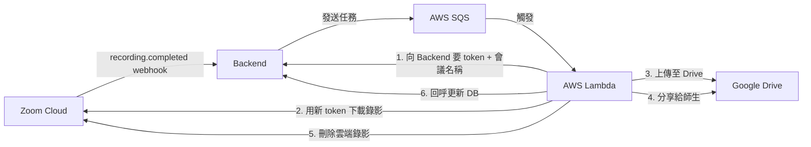
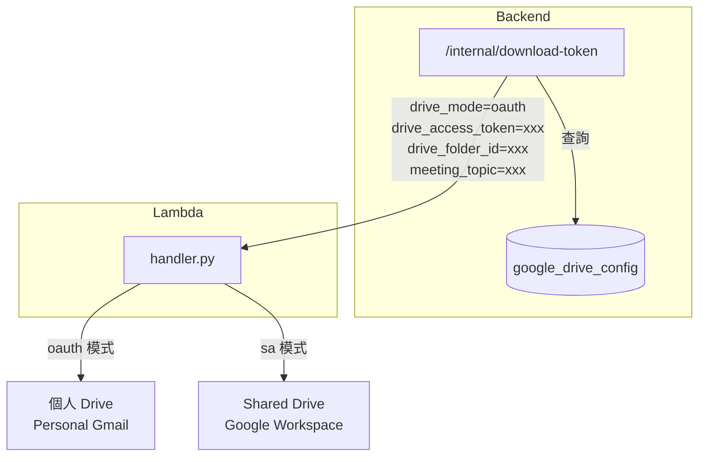
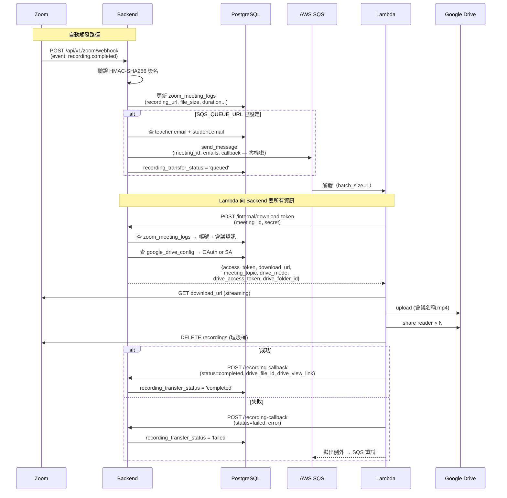
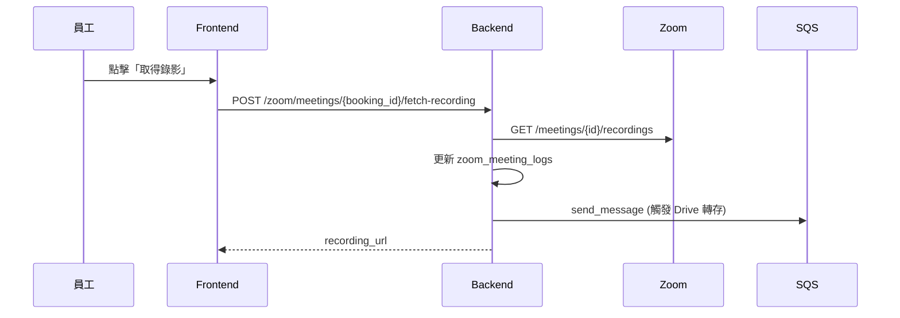
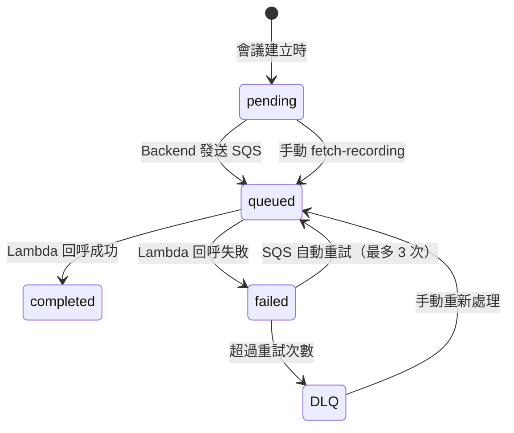
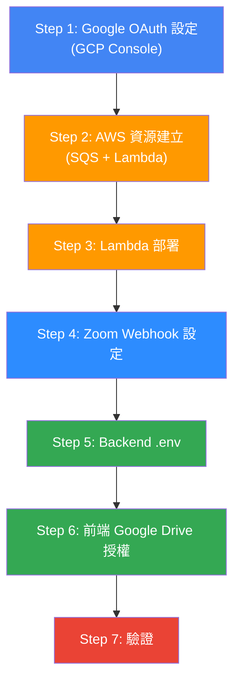
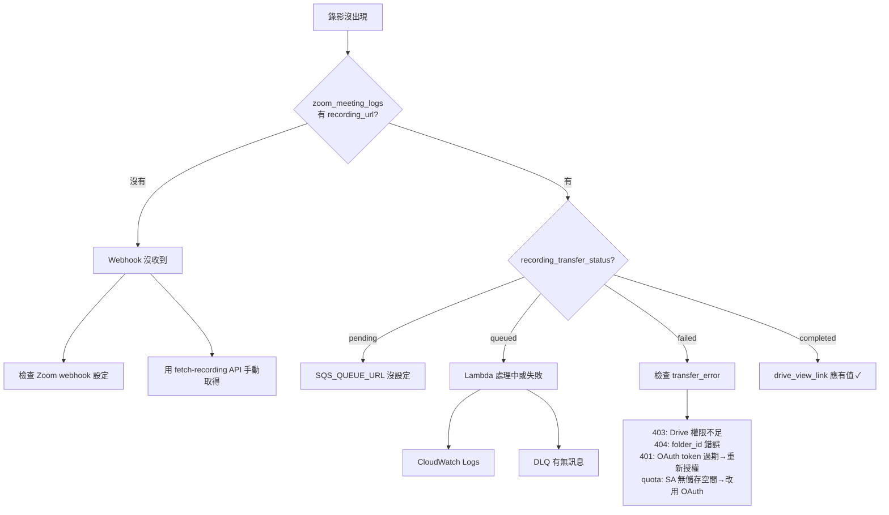

# Zoom 錄影自動上傳 Google Drive

Zoom 雲端錄影有儲存空間限制且下載 URL 會過期。本功能在 `recording.completed` webhook 觸發後，自動將錄影檔下載並上傳至 Google Drive 保存，並分享給該堂課的老師和學生。

支援兩種 Drive 模式：
- **OAuth 模式（個人 Gmail）**：管理員授權一次，系統用 refresh token 持續上傳
- **SA 模式（Google Workspace）**：Service Account + Shared Drive

---

## 架構總覽



### 雙模式架構



| 模式 | 適用對象 | Drive 憑證來源 | 需要 |
|------|---------|---------------|------|
| **OAuth** | 個人 Gmail | Backend DB (refresh token) | 前端一次授權 |
| **SA** | Google Workspace | Lambda 環境變數 | Shared Drive + SA 權限 |

---

## 完整時序圖



### 手動觸發路徑



---

## 狀態流轉



| 狀態 | 說明 |
|------|------|
| `pending` | 預設值，尚未觸發轉移 |
| `queued` | 已發送 SQS，等待 Lambda 處理 |
| `completed` | Google Drive 上傳完成，`drive_view_link` 已寫入 |
| `failed` | 轉移失敗，`transfer_error` 有錯誤訊息 |

---

## 安全架構

```
┌───────────────────────────────────────┐
│ SQS 訊息（零機密）                      │
│  meeting_id, share_emails,            │
│  callback_url, callback_secret        │
└───────────────┬───────────────────────┘
                │
┌───────────────▼───────────────────────┐
│ Lambda                                │
│  SA 模式: 環境變數 GOOGLE_SA_CREDS    │
│  OAuth 模式: Backend 即時回傳 token    │
│  Zoom 憑證: 完全不知道                 │
└───────────────┬───────────────────────┘
                │ POST /internal/download-token
┌───────────────▼───────────────────────┐
│ Backend（唯一的 secret 來源）           │
│  Zoom 帳號池 (DB)                      │
│  Google OAuth refresh_token (DB)       │
│  驗證: RECORDING_CALLBACK_SECRET       │
└───────────────────────────────────────┘
```

---

## 檔案命名

上傳到 Drive 的錄影檔名格式：

```
[BK20260329003] 一般課程 Dennis Test Teacher 2026-03-29 1400.mp4
 ^^^^^^^^^^^^   ^^^^^^^^ ^^^^^^ ^^^^^^^^^^^^  ^^^^^^^^^^  ^^^^
 預約編號        課程名稱  學生   教師          日期        時間
```

由 Backend `/internal/download-token` 的 `meeting_topic` 欄位回傳，Lambda 直接使用。

---

## 部署流程



### Step 1: Google OAuth 設定（GCP Console）

```
1. https://console.cloud.google.com/ → 選專案
2. API & Services → Library → 啟用 "Google Drive API"
3. API & Services → OAuth consent screen
   - User Type: External
   - App name: EOP 教學管理系統
   - Scopes: drive.file, openid, email, profile
   - Test users: 加入要授權的 Gmail
4. API & Services → Credentials → + CREATE CREDENTIALS → OAuth client ID
   - Type: Web application
   - Redirect URI: http://localhost:8001/api/v1/google-drive/oauth/callback
   - 記下 Client ID 和 Client Secret
```

### Step 2: AWS 資源建立

```bash
bash scripts/setup-sqs-lambda.sh --profile EOP-admin-dennis
# 記下 SQS_QUEUE_URL
```

### Step 3: Lambda 部署

```bash
cd lambda/zoom-recording-downloader
cp .env.lambda.example .env.lambda
# 編輯 .env.lambda: GOOGLE_DRIVE_FOLDER_ID, GOOGLE_SA_CREDENTIALS（SA 模式用）
# OAuth 模式可留空（由 Backend 提供）
bash deploy.sh --profile EOP-admin-dennis
```

### Step 4: Zoom Webhook 設定

```
Zoom Marketplace → App → Event Subscriptions
- URL: https://{DOMAIN}/api/v1/zoom/webhook
- Events: meeting.started, meeting.ended, recording.completed
- 記下 Secret Token
```

### Step 5: Backend .env

```bash
# Google Drive OAuth
GOOGLE_DRIVE_OAUTH_CLIENT_ID=xxxxx.apps.googleusercontent.com
GOOGLE_DRIVE_OAUTH_CLIENT_SECRET=GOCSPX-xxxxx
GOOGLE_DRIVE_OAUTH_REDIRECT_URI=http://localhost:8001/api/v1/google-drive/oauth/callback

# Zoom 錄影轉移
SQS_QUEUE_URL=https://sqs.ap-northeast-1.amazonaws.com/...
RECORDING_CALLBACK_SECRET=xxx
BACKEND_BASE_URL=https://your-domain.com
ZOOM_WEBHOOK_SECRET_TOKEN=xxx

# 重啟
docker compose up --build backend -d
```

### Step 6: 前端 Google Drive 授權

```
1. 登入員工帳號 → Zoom 帳號頁面
2. 下方「Google Drive 錄影儲存」→ 綁定 Google Drive
3. Google OAuth 授權畫面 → 同意
4. 回到系統 → 顯示已綁定 email
5. 設定目標資料夾 ID → 儲存
```

### Step 7: 驗證

```bash
# 建立預約 → Zoom 會議 → 開會+錄影 → 結束 → 等 2-3 分鐘
docker exec teaching-platform-db psql -U postgres -c "
  SELECT zoom_meeting_id, recording_transfer_status,
         LEFT(drive_view_link, 50) as drive_url
  FROM zoom_meeting_logs ORDER BY updated_at DESC LIMIT 5;"
```

---

## SQS 訊息格式

```json
{
  "meeting_id": "88160937200",
  "file_type": "MP4",
  "file_size": 314572800,
  "share_emails": ["teacher@gmail.com", "student@gmail.com"],
  "callback_url": "https://api.eop.com/api/v1/zoom/recording-callback",
  "callback_secret": "random-secret"
}
```

> 不含任何 Zoom/Google 憑證。Lambda 透過 Backend internal API 即時取得。

---

## SQS 重試機制

| 設定 | 值 | 說明 |
|------|---|------|
| VisibilityTimeout | 960s | 訊息鎖定時間 |
| MaxReceiveCount | 3 | 最多重試 3 次 |
| MessageRetentionPeriod | 86400s | 保留 24 小時 |
| DLQ | `zoom-recording-download-dlq` | 失敗 3 次後歸屬 |

---

## DB 欄位

### zoom_meeting_logs（錄影資料）

| 欄位 | 型別 | 說明 |
|------|------|------|
| `recording_url` | TEXT | Zoom 雲端播放 URL |
| `recording_download_url` | TEXT | Zoom 下載 URL |
| `recording_file_type` | VARCHAR(20) | MP4 |
| `recording_file_size_bytes` | BIGINT | 檔案大小 |
| `recording_duration_seconds` | INT | 錄影時長 |
| `recording_completed_at` | TIMESTAMPTZ | 錄影完成時間 |
| `recording_transfer_status` | VARCHAR(20) | pending/queued/completed/failed |
| `drive_file_id` | TEXT | Google Drive 檔案 ID |
| `drive_view_link` | TEXT | Google Drive 檢視連結 |
| `transfer_error` | TEXT | 失敗錯誤訊息 |
| `transferred_at` | TIMESTAMPTZ | 轉移完成時間 |

### google_drive_config（Drive 設定）

| 欄位 | 型別 | 說明 |
|------|------|------|
| `drive_mode` | VARCHAR(20) | `oauth` 或 `sa` |
| `google_access_token` | TEXT | OAuth access token |
| `google_refresh_token` | TEXT | OAuth refresh token |
| `google_token_expires_at` | TIMESTAMPTZ | Token 過期時間 |
| `google_email` | VARCHAR(255) | 授權的 Google 帳號 |
| `drive_folder_id` | TEXT | 上傳目標資料夾 |
| `linked_by` | UUID | 授權的管理員 |
| `is_active` | BOOLEAN | 啟用狀態 |

---

## 環境變數

### Backend (.env)

| 變數 | 說明 |
|------|------|
| `GOOGLE_DRIVE_OAUTH_CLIENT_ID` | GCP OAuth Client ID |
| `GOOGLE_DRIVE_OAUTH_CLIENT_SECRET` | GCP OAuth Client Secret |
| `GOOGLE_DRIVE_OAUTH_REDIRECT_URI` | OAuth callback URL |
| `SQS_QUEUE_URL` | SQS queue URL（空 = 停用） |
| `RECORDING_CALLBACK_SECRET` | Lambda 回呼 + internal API 驗證 |
| `BACKEND_BASE_URL` | Lambda 回呼用 URL |
| `ZOOM_WEBHOOK_SECRET_TOKEN` | Zoom webhook 簽名驗證 |

### Lambda (.env.lambda)

| 變數 | 說明 | OAuth 模式 | SA 模式 |
|------|------|-----------|---------|
| `GOOGLE_DRIVE_FOLDER_ID` | Drive 資料夾 ID | 不需要（Backend 提供） | 需要 |
| `GOOGLE_SA_CREDENTIALS` | SA JSON (base64) | 不需要 | 需要 |

---

## API 端點

| 端點 | 用途 | 認證 |
|------|------|------|
| `POST /api/v1/zoom/webhook` | Zoom webhook | HMAC-SHA256 |
| `POST /api/v1/zoom/meetings/{id}/fetch-recording` | 手動取得錄影 | 員工 cookie |
| `POST /api/v1/zoom/internal/download-token` | Lambda 取 token + 會議名稱 | secret |
| `POST /api/v1/zoom/recording-callback` | Lambda 回報結果 | secret |
| `GET /api/v1/google-drive/oauth/authorize` | Google OAuth 授權 URL | 員工 cookie |
| `GET /api/v1/google-drive/oauth/callback` | OAuth callback | - |
| `GET /api/v1/google-drive/oauth/status` | 查詢綁定狀態 | 登入 cookie |
| `DELETE /api/v1/google-drive/oauth/unlink` | 解除綁定 | 員工 cookie |
| `PUT /api/v1/google-drive/folder` | 設定目標資料夾 | 員工 cookie |

---

## 故障排除



### 常用除錯指令

```bash
# 查轉移狀態
docker exec teaching-platform-db psql -U postgres -c "
  SELECT zoom_meeting_id, recording_transfer_status, transfer_error,
         LEFT(drive_view_link, 50)
  FROM zoom_meeting_logs
  WHERE recording_transfer_status IS NOT NULL
  ORDER BY updated_at DESC LIMIT 10;"

# 查 Google Drive 設定
docker exec teaching-platform-db psql -U postgres -c "
  SELECT drive_mode, google_email, drive_folder_id, is_active
  FROM google_drive_config;"

# 查 Lambda 日誌
aws --profile EOP-admin-dennis logs filter-log-events \
  --log-group-name /aws/lambda/zoom-recording-downloader \
  --start-time $(( $(date +%s) - 3600 ))000 \
  --region ap-northeast-1 --no-cli-pager \
  --query 'events[*].message' --output text | tail -20

# 手動觸發
curl -X POST https://{DOMAIN}/api/v1/zoom/meetings/{booking_id}/fetch-recording \
  -b "access_token=..."
```

---

## 相關檔案

| 檔案 | 說明 |
|------|------|
| `backend/app/services/zoom_service.py` | webhook handler + SQS 發送 + fetch_meeting_recording |
| `backend/app/services/google_drive_service.py` | Google OAuth token 管理 |
| `backend/app/api/v1/zoom.py` | webhook + internal/download-token + fetch-recording + callback |
| `backend/app/api/v1/google_drive.py` | Google Drive OAuth 端點 |
| `backend/app/schemas/zoom.py` | DownloadTokenResponse (含 meeting_topic, drive_mode) |
| `backend/app/config.py` | GOOGLE_DRIVE_OAUTH_* 設定 |
| `lambda/zoom-recording-downloader/handler.py` | 下載 + 上傳 + 分享（雙模式） |
| `lambda/zoom-recording-downloader/deploy.sh` | 部署（互動式 profile 選擇） |
| `scripts/setup-sqs-lambda.sh` | AWS 資源建立 |
| `scripts/aws-profile-select.sh` | AWS profile 選擇器 |
| `supabase/migrations/038_recording_transfer_status.sql` | 錄影轉移欄位 |
| `supabase/migrations/045_google_drive_oauth.sql` | Google Drive OAuth 表 |

---

## 成本估算（200 堂/月）

| 項目 | OAuth 模式 | SA 模式 |
|------|-----------|---------|
| Google Drive 儲存 | 免費 15GB / $2.99 100GB | Workspace $7.20/月 |
| Lambda | ~$1.67 | ~$1.67 |
| SQS | ~$0.001 | ~$0.001 |
| **合計** | **~$2-5/月** | **~$9/月** |
